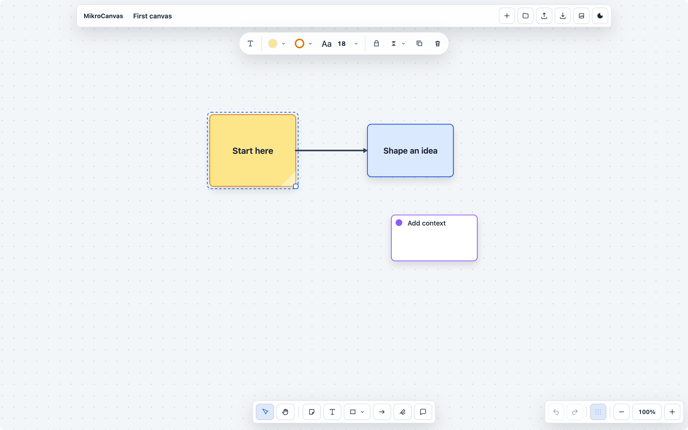

:::tip[Use MikroCanvas Online]
Open [canvas.mikrosuite.com](https://canvas.mikrosuite.com) to use MikroCanvas directly for free. It runs over HTTPS, needs no account, and keeps boards in browser storage for that site unless you export them.
:::

MikroCanvas is a small local-first visual canvas for thinking in boxes, notes, arrows, and quick sketches. It is designed for fast ad hoc diagrams, lightweight planning, architecture notes, and visual drafts that should stay under your control.

Boards live in browser IndexedDB by default. MikroCanvas does not require an account, a workspace, or a remote service. You can move data between browsers or machines by exporting board files.

## When to use it

- Map an idea before it becomes a document or plan.
- Sketch product flows, system diagrams, and small process maps.
- Capture notes with sticky cards, comments, shapes, arrows, and freehand marks.
- Keep a portable whiteboard that can be hosted as static HTML, CSS, and JavaScript.

## Product boundaries

MikroCanvas is intentionally compact. It is not trying to replace a multiplayer design suite, a presentation app, or a vector illustration tool. It focuses on quick local boards, direct manipulation, and durable export paths.
